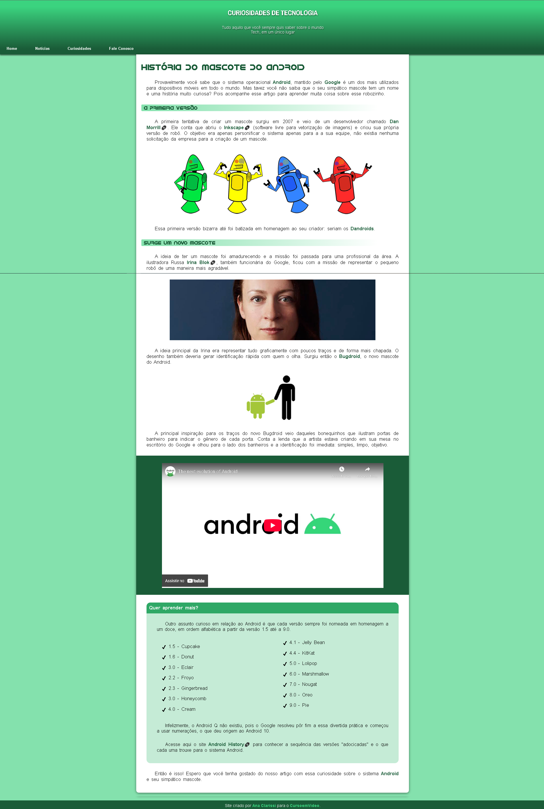

# Projeto Android 🤖

Este projeto foi desenvolvido como um desafio prático do curso de **HTML5 e CSS3** Módulo 2 do [Curso em Vídeo]([https://www.cursoemvideo.com](https://www.youtube.com/watch?v=vPNIAJ9B4hg&list=PLHz_AreHm4dlUpEXkY1AyVLQGcpSgVF8s)). O objetivo foi criar um site responsivo, semântico e visualmente atraente explorando a história do mascote do Android.

## 🔗 Demonstração
Você pode visualizar o projeto online aqui: **[Projeto Android](https://anaClarissi.github.io/desafio-android/)**

## 🛠️ Tecnologias e Conceitos Aplicados
Durante o desenvolvimento, apliquei conceitos fundamentais de Front-End:
- **HTML5 Semântico:** Uso correto de tags como `header`, `nav`, `main`, `section`, `article` e `footer`.
- **CSS3 Avançado:** Manipulação de fontes externas com `@font-face`, variáveis CSS (`:root`), gradientes e sombras.
- **Responsividade:** Adaptação do layout para diferentes tamanhos de tela (Mobile First).
- **Customização:** Estilização de barras de rolagem e pseudo-elementos (`::after`, `::before`).

## 🎨 O que eu aprendi
Neste desafio, foquei em resolver problemas reais de design, como:
- Importação e otimização de fontes personalizadas (IDroid).
- Criação de listas em colunas flexíveis.
- Alinhamento de elementos multimídia (iframes e imagens).
- Organização de camadas visuais com `z-index`.

## ✒️ Autor
Desenvolvido por **Ana Clarissi** – [Meu Linkedin](www.linkedin.com/in/anaclarissi)
